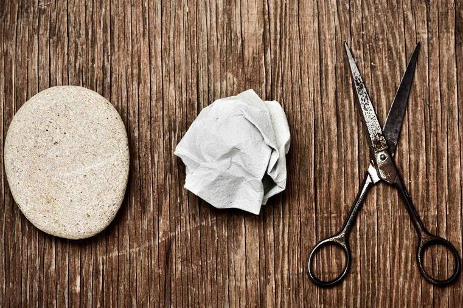

# Rock Paper Scissors

A simple game nearly anyone knows, and those who do not know it would be able to learn it virtually without instructions. Still, in my opinion, an excellent way for a coder to be able to flex their skills a little bit and understand the nature of repetition and exploit it to minimize code.

## Features 

### Existing Features

- __Sanitanial Computer__

  - Since during the development of this code, a pandemic is crossing our nations. It's essential always to practice hygiene no matter where you are.
  - Because of this, our game features a built-in, unlimited stock of hand wash that your computer will use anytime you wish to reset scores. 

- __Scoring system__

  - Maybe you are here to brag to friends about how great you are at Rock Paper Scissors.
  - Maybe wish to monitor and measure your luck.
  - Maybe you are just bored. In any case, we got it all here!

- __Animated judge to announce result__

  - Just in case you forgot how this game works, and you are confused about whether or not you're losing when you have the most points in the "Loss" field.
  - Features a highly calibrated system of systematically fading out the announcement as soon as it's confirmed read. Double function of hiding the shame of victories over a simple computer.

### Features Left to Implement

- Hard studies performed by voluntary, civilian work prooves that animations probably increases a users dopamine levels by a probability of possibly greater than null. By this logic, more animations!
- Options such as difficulties and game modes.

## Testing 

Thorough testing was done using multiple explorers and resizing them in inspection mode, and opening the document on my phone and tablet to ensure as pleasant an experience on as many platforms as possible.

Almost everything is responsive and will scale to the needs of virtually any standard screen size and orientations today on the market.

I even took extra measures to keep everything in place regardless of hidden elements or not.

### Validator Testing 

- HTML
  - No errors were returned when passing through the official [W3C validator](https://validator.w3.org/nu/?showsource=yes&useragent=Validator.nu%2FLV+http%3A%2F%2Fvalidator.w3.org%2Fservices&acceptlanguage=&doc=https%3A%2F%2Fgithub.com%2FSodori%2FRPC_TheGame%2Fblob%2Fmain%2Findex.html)
- CSS
  - No errors were found when passing through the official [(Jigsaw) validator](https://jigsaw.w3.org/css-validator/validator?uri=https%3A%2F%2Fgithub.com%2FSodori%2FRPC_TheGame%2Fblob%2Fmain%2Findex.html&profile=css3svg&usermedium=all&warning=1&vextwarning=&lang=en#css)

### Unfixed Bugs

- Nothing that I've been able to uncover

## Deployment

The live link can be found here - https://sodori.github.io/RPC_TheGame/

## Credits 

### Content 

- The image headlining this page was a simple Google Image search
- The hand icons all come from  [Font Awesome](https://fontawesome.com/)

### Media

- The image headlining this page was a simple Google Image search
